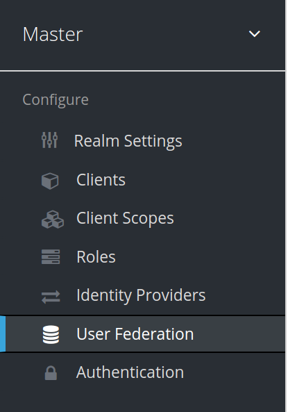
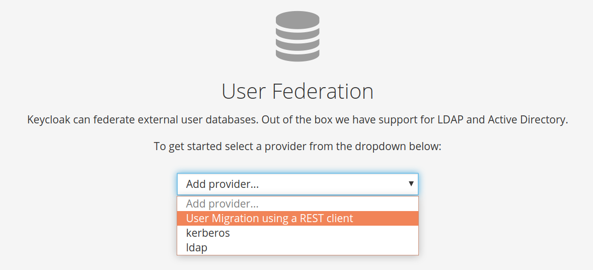

# Keycloak user migration plugin


[](https://sonarcloud.io/dashboard?id=keycloak-user-migration)
[](https://sonarcloud.io/dashboard?id=keycloak-user-migration)
[](https://sonarcloud.io/dashboard?id=keycloak-user-migration)
[](https://sonarcloud.io/dashboard?id=keycloak-user-migration)
[](https://sonarcloud.io/dashboard?id=keycloak-user-migration)
[](https://sonarcloud.io/dashboard?id=keycloak-user-migration)
[](https://sonarcloud.io/dashboard?id=keycloak-user-migration)

## Introduction

This is a user migration plugin for Keycloak. Read more at:

https://codesoapbox.dev/keycloak-user-migration

## Compatibility

| Keycloak Version | Commit                                                                                                                                           |
|------------------|--------------------------------------------------------------------------------------------------------------------------------------------------|
| 11.X             | Current                                                                                                                                          |
| 9.X              | [c9c64162b91cedc29d8bf360c3df50b69fdb4c6b](https://github.com/daniel-frak/keycloak-user-migration/tree/c9c64162b91cedc29d8bf360c3df50b69fdb4c6b) |

## Prerequisites - REST endpoints in the legacy system  

You must provide two REST endpoints (GET and POST) in your legacy authentication system under the URI `${restClientUri
}/{$username}`, where `${restClientUri}` is a configurable base URL for the endpoints and `{$username}` is the
username of the user that is attempting to sign in.

### GET
The GET request will have to return user data as a JSON response in the form:
```json
{
    "id": "string",
    "username": "string",
    "email": "string",
    "firstName": "string",
    "lastName": "string",
    "enabled": "boolean",
    "emailVerified": "boolean",
    "attributes": {
      "key": ["value"]
    },
    "roles": ["string"],
    "groups": ["string"]
}
```

Any HTTP status other than `200` will be interpreted as the user not having been found. 

The `id` attribute in the above response is optional. If it's not set Keycloak will generate a new user id automatically.

### POST
The POST request is for password validation. It will have to accept the following body:
```json
{
    "password": "string"
}
```

...And return HTTP status 200 if the password is correct. Any other response will be treated as invalid credentials.

### Example REST client behavior

Let's assume we have configured the legacy REST service under the URL `http://www.old-legacy-system.com/auth`.

If a user with the username `bob` and the password `password123` tries to log in through Keycloak for the first time
(giving correct credentials), a GET request will be performed to `http://www.old-legacy-system.com/auth/bob`.
The response might look like this:
```json
{
    "username": "bob",
    "email": "bob@company.com",
    "firstName": "Bob",
    "lastName": "Smith",
    "enabled": "true",
    "emailVerified": "true",
    "attributes": {
      "position": ["rockstar-developer"],
      "likes": ["cats", "dogs", "cookies"]
    },
    "roles": ["admin"],
    "groups": ["migrated_users"]
}
```

As the user has been found, a POST request will be performed to `http://www.old-legacy-system.com/auth/bob`, with
the body:
```json
{
    "password": "password123"
}
```

As this is the correct password, the user will be logged in. In the background, his information will be migrated to
Keycloak.

## Launching and configuring the example
1. Navigate to `./docker`
2. Execute `docker-compose up`
3. Open `http://localhost:8024/auth/admin/` in a browser
4. Log in with the credentials:
* User: `admin`
* Password: `admin`
5. Navigate to "User federation":



6. Choose "User migration using a REST client" from the "Add provider..." dropdown:



7. Provide the legacy system endpoint URI in the "Rest client URI" field:


8. Click "save":


User migration should now work - Keycloak will recognize all users from your legacy authentication system and migrate
them automatically.
 
## Optional - additional configuration

Additional configuration options are available for fine-tuning the migration. 


### API Token

The migration endpoint can be secured with an API token. The configured value will be sent as a bearer token in the authorization header.

If the configured token value is set to `SECRET_API_TOKEN` when making the request to the migration endpoints, the rest client will send the following authorization header:
```
Authorization: Bearer SECRET_API_TOKEN
```

### Legacy role conversion

If role names in Keycloak do not perfectly match those in the legacy system, you can configure the provider to
automatically map legacy roles to Keycloak roles, by specifying the mapping in the format `legacyRole:keycloakRole`.

Note that roles cannot be created during import, they need to exist in Keycloak first.

### Migrate unmapped roles

This switch can be toggled to decide whether roles which are not defined in the legacy role conversion map should be
 migrated anyway or simply ignored.  

### Group role conversion

If group names in Keycloak do not perfectly match those in the legacy system, you can configure the provider to
automatically map legacy groups to Keycloak groups, by specifying the mapping in the format `legacyGroup:keycloakGroup`.

### Migrate unmapped groups

This switch can be toggled to decide whether groups which are not defined in the legacy group conversion map should be
 migrated anyway or simply ignored.
