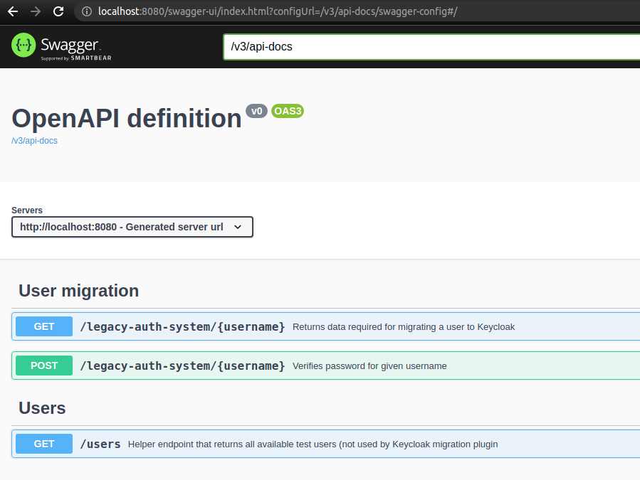

# legacy-system-example

This project is an example of how you can adjust your legacy identity provider to work with
[Keycloak user migration plugin](https://github.com/daniel-frak/keycloak-user-migration).

## Getting started

### Prerequisites

* JDK 11+
* Maven (or you can use mvnw provided in the project)

Once you have the code available locally, you can build the project with:

```bash
mvn clean install
```

You can start the app with:

```bash
mvn spring-boot:run
```

## API documentation

First, build and run the application. Then you'll be able to reach the API docs.

### Swagger

The Swagger UI page: [http://localhost:8080/swagger-ui.html](http://localhost:8080/swagger-ui.html):



### OpenAPI

The OpenAPI description in json format is available at the following url: 
[http://localhost:8080/v3/api-docs](http://localhost:8080/v3/api-docs):


## Built With

* [Spring Boot v2.5+](https://spring.io/projects/spring-boot)
* [Maven](https://maven.apache.org/)
* [springdoc-openapi](https://springdoc.org/)